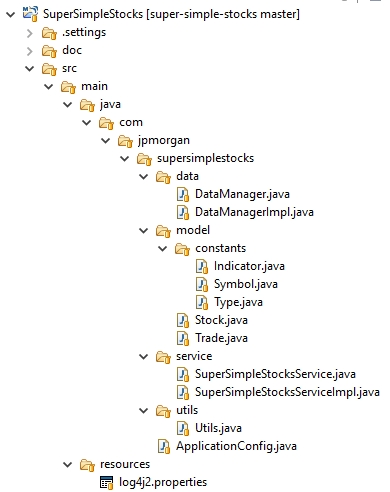
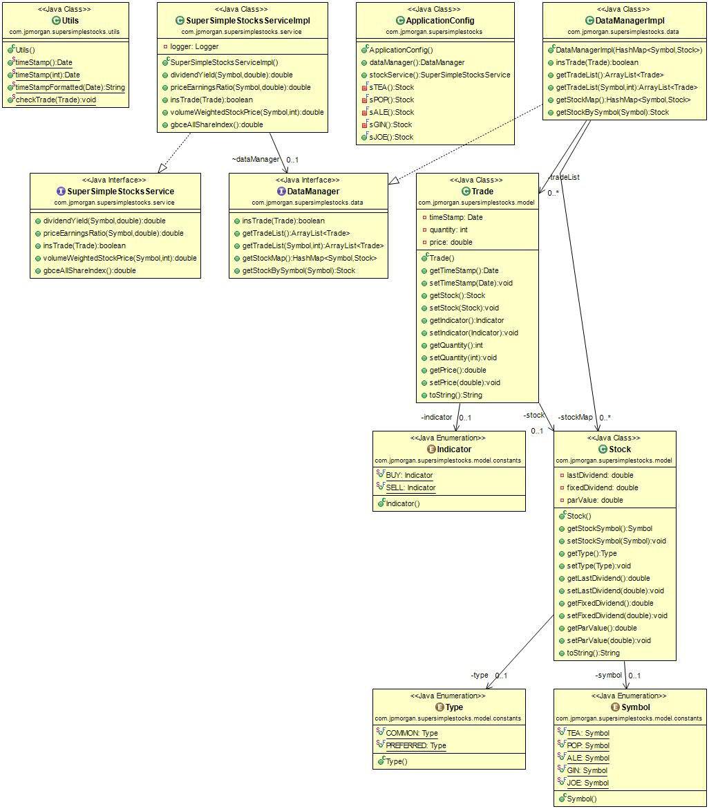

#SuperSimpleStocks application

###  Architecture
The implementation of this solution is based on a service interface that provides the functionalities requested to the user. The back-end is based on a data-manager interface accessible from the service implementation. The objects modelled are pojos (plain old java objects) of "Stock" and "Trade".

The framework used is Spring, configured using ApplicationConfig and annotations.

##### Service layer
The Service interface "SuperSimpleStocksService" provides the functionalities requested:
 - dividendYield(Symbol symbol, double price)  
 - priceEarningsRatio(SymbolinsTrade(Trade trade)
 - volumeWeightedStockPrice(Symbol symbol, int minutes)
 - gbceAllShareIndex()

##### Data layer
 The interface "DataManager" provides the data access and data management:
- insTrade(Trade trade) throws Exception;
- getTradeList();
- getTradeList(Symbol symbol, int minutes) throws Exception;;
- getStockMap();
- getStockBySymbol(Symbol symbol);


> **Note:** Symbol is the Stock Symbol used as Stock id

----------

##### Project Structure


----------

##### Class diagram


----------

###  Execution
SuperSimpleStocks  is a maven project, you can import into Eclipse as a maven project. 

Using the command
```
maven clean install
```
maven will compile and will execute the test provided just for the SuperSimpleStocksService. Other tests used for the development will be ignored. 

----------

###  Documentation
[JavaDoc](https://github.com/fabriziozandonella/super-simple-stocks/tree/master/SuperSimpleStocks/doc) 

----------

###  Future developments
Convertion of the project as a Microservice, providing: 
 * a RESTful API,
 * a Messagge service for possible integration with other Microservices. 
 * a Back end using a noSql database such as MongoDB
 
----------
